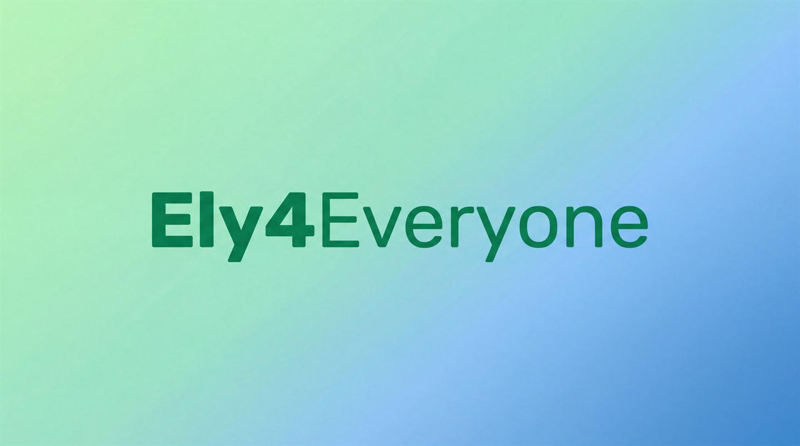

# Ely4Everyone

> Fabric-мод, который превращает любой совместимый клиент в Ely.by-клиент.

> [!WARNING]
> Этот проект написан преимущественно при помощи AI и должен рассматриваться как **экспериментальный**.
>
> Это значит:
> - значительная часть кода, структуры и текста была сгенерирована или собрана с помощью AI;
> - проект может содержать архитектурные ошибки, скрытые баги, небезопасные решения и непродуманные компромиссы;
> - код не следует считать автоматически качественным, безопасным или production-ready только потому, что он опубликован на GitHub.
>
> Если вы хотите использовать `Ely4Everyone`, форкать его или запускать на реальном сервере, пожалуйста, сначала проведите **собственный аудит кода, конфигов, сетевого поведения и модели безопасности**.

`Ely4Everyone` строится как **mod-first проект**. Главная идея не в том, чтобы заставить игроков использовать наш серверный стек, а в том, чтобы дать любому клиенту с `Fabric` нормальную Ely.by-идентичность:

- Ely.by UUID
- Ely.by nickname
- Ely.by skins / textures
- Ely.by session для входа на Ely-authlib сервера

Если игрок запускает Minecraft из любого лаунчера, который умеет грузить `Fabric`, и ставит `Ely4Everyone`, клиент должен вести себя ближе не к "пирату с паролем", а к полноценному Ely.by-пользователю.

## Основная цель

Проект нацелен на два режима, но они не равны по важности.

### 1. Universal Ely Client

Это главный режим.

Мод должен:

- запускаться из любого лаунчера с `Fabric`;
- выполнять вход через Ely.by;
- хранить Ely session на клиенте;
- подменять локальную Minecraft session на Ely identity;
- использовать Ely UUID, ник и Ely textures;
- проходить на серверы, которые уже поддерживают Ely.by через `authlib-injector` или совместимую authlib-схему.

Именно это и есть изначальная идея проекта: не "наш сервер умеет принять мод", а "мод делает клиент Ely.by-клиентом".

### 2. Server-Integrated Fast Login

Это дополнительный режим.

Для собственных серверов можно добавить:

- доверенный login channel;
- fast login / password bypass;
- интеграцию с `FastLogin`, `AuthMe` и подобными backend-плагинами.

Этот слой полезен, но он **не должен быть основным смыслом проекта**.

## Что проект должен дать игроку

Игрок с `Ely4Everyone` должен в идеале получить:

- возможность логиниться в Ely.by без отдельного лаунчера;
- Ely UUID вместо offline UUID;
- Ely nickname вместо локальной/offline identity;
- Ely skins и корректные textures properties;
- проход на Ely-authlib сервера так, как будто клиент изначально понимает Ely.by;
- на поддерживаемых серверах проекта — login без лишнего пароля.

## Что это не значит

Чтобы не обещать магию:

- vanilla-клиент без `Fabric` не поддерживается;
- серверы, которые не поддерживают Ely.by вообще, сами по себе не станут Ely-серверами от одного клиентского мода;
- `client_secret` нельзя безопасно держать внутри open-source клиента;
- universal Ely client и server-side fast login — это связанные, но разные задачи.

## Архитектура проекта

### Fabric mod

Основной продукт проекта.

Сейчас мод отвечает или будет отвечать за:

- Ely OAuth/browser flow;
- хранение Ely session на клиенте;
- выбор auth host;
- UI в главном меню;
- получение Ely identity;
- подмену локальной клиентской session;
- подготовку к работе с Ely-authlib серверами;
- optional login response для server-integrated режима.

### Embedded auth host

Пока Ely OAuth требует `client_secret`, у проекта должен быть backend-компонент.

Сейчас этот backend встроен в `Velocity` plugin и выполняет:

- OAuth code exchange;
- получение Ely account info;
- выдачу клиентской Ely auth session;
- dev/test endpoints;
- challenge-bound login ticket для server-integrated режима.

В долгосрочной модели это не главный продукт, а вспомогательная часть вокруг mod-first клиента.

### Velocity plugin

Нужен для собственного серверного режима:

- challenge / response логин;
- валидация Ely tickets;
- trusted profile application;
- bridge к backend-серверам.

### Paper bridge

Нужен только для серверных сценариев:

- auto-login command;
- интеграция с `AuthMe`-style backend;
- trusted forwarded UUID flow.

## Текущий фокус разработки

Проект уже прошел через прототип `Velocity/Paper`-ветки, и это было полезно:

- OAuth flow жив;
- auth-host жив;
- challenge/ticket pipeline в целом доказал жизнеспособность;
- Paper bridge тоже завелся.

Но основной фокус теперь смещается на **universal Ely client внутри мода**.

То есть следующие важные шаги — это не "еще один серверный костыль", а:

- клиентская Ely session;
- клиентская Ely identity;
- клиентская подмена Minecraft session;
- совместимость с Ely-authlib серверами.

## Текущее состояние

На сегодня в репозитории уже есть:

- рабочий Fabric-мод с UI и Ely auth flow;
- встроенный auth-host внутри `Velocity`;
- `Velocity` plugin для trusted login;
- `Paper bridge` для backend bypass;
- тестовый стенд `servers/velocity` и `servers/minecraft`.

При этом universal Ely client пока **еще не завершен**. Мы уже начали двигаться в эту сторону: мод хранит Ely session и начинает получать Ely identity, но клиентская auth/session подмена пока только в работе.

## Репозиторий

- `mod/` — основной Fabric-мод
- `velocity-plugin/` — optional proxy integration
- `paper-bridge/` — optional backend integration
- `relay/` — legacy/experimental backend module, не основной вектор проекта
- `servers/` — локальный тестовый стенд, не входит в публичный репозиторий

## Безопасность и доверие

Главный неудобный факт остается тем же:

Ely OAuth сейчас требует `client_secret`, а значит полностью автономный open-source клиент без backend-части ограничен.

Поэтому текущая практическая модель такая:

- мод open-source;
- auth host open-source;
- auth host можно self-host'ить;
- `client_secret` держится только на серверной стороне;
- клиент не хранит серверные секреты;
- короткоживущие login tickets используются только там, где это действительно нужно.

## Roadmap

### Universal Ely Client

- [ ] Хранение полной Ely session на клиенте
- [ ] Ely identity manager внутри мода
- [ ] Подмена локальной Minecraft session на Ely identity
- [ ] Ely textures / skins на клиенте
- [ ] Совместимость с Ely-authlib серверами
- [ ] Минимальный UX без лишней ручной настройки

### Server Integration

- [x] Embedded auth host
- [x] Challenge-bound Ely login ticket
- [x] Trusted login prototype
- [x] Paper bridge prototype
- [ ] Дожать production-grade proxy/backend flow

## Статус идеи

Идея **реальна**, но сложная.

Если формулировать честно:

- сделать мод, который дает Ely UUID/skin/nickname и живет в любом Fabric-совместимом лаунчере — **реально**;
- сделать из него universal Ely client для Ely-authlib серверов — **реально, но это ядро проекта и требует отдельной клиентской auth/session интеграции**;
- сделать fast login для своих серверов — **реально и уже частично работает**.

Это не маленький utility-мод. Это полноценный клиентский identity-layer над Minecraft.

## Автор

Основной автор проекта: **Cokeef**.

- GitHub: [@Cokeef](https://github.com/Cokeef)

## Лицензия

Проект распространяется по лицензии **MIT**. Это максимально permissive вариант: код можно использовать, менять, публиковать и встраивать в другие проекты, если сохраняются текст лицензии и уведомление об авторстве.

Полный текст лицензии лежит в [LICENSE](./LICENSE).
